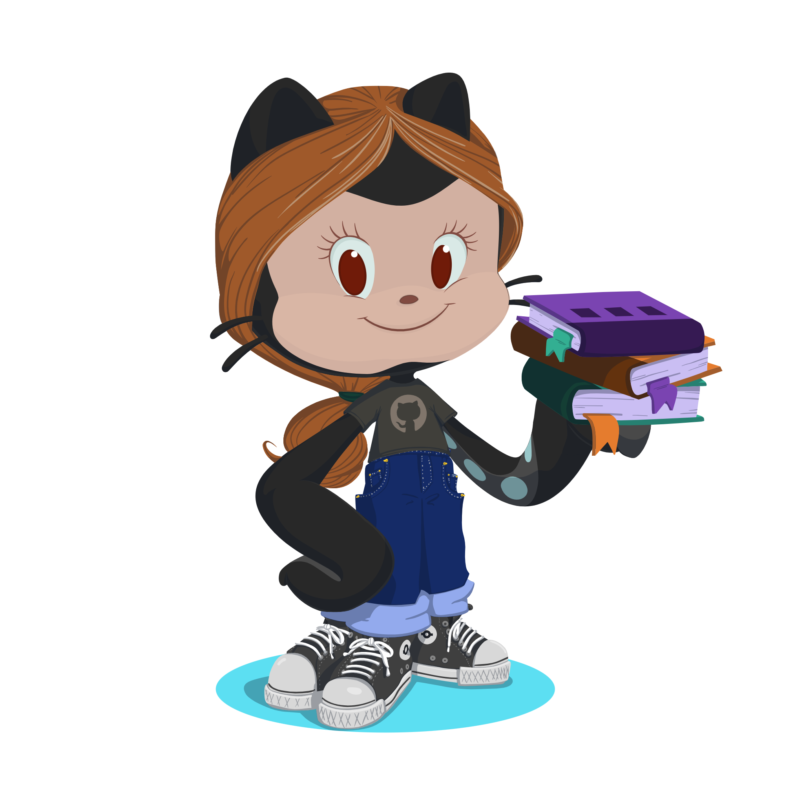
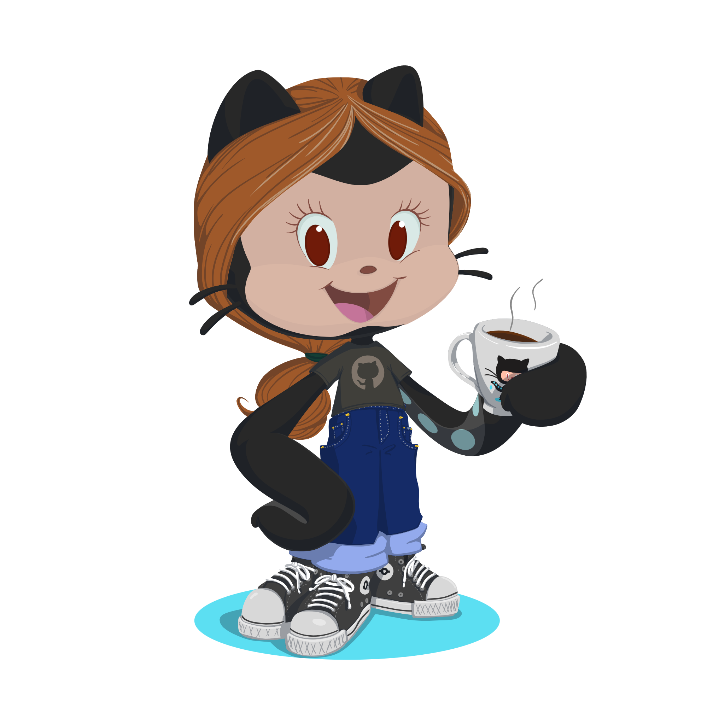

<h1 align="center">Hi there, I'm Juliana 👋</h1>

  💻 Computer Science Student | 🌐 Web Developer | 🔬 Research Enthusiast

---

### 🪄 About Me

My name is Juliana Ivo, and I'm a Computer Science student. I'm always looking to learn and grow in the technology field. In addition to my pursuit of becoming a good Software Engineer, I also strive to grow in academic research, a field I truly enjoy. Currently, I'm an official Technological Initiation volunteer on the research project titled "Forensic Project Exploring the Metaverse and Artificial Intelligence in the Creation of Digital Twins of MetaHumans." 🚀  

  

---

### ⚙ Skills

---

### 🧰 Development Tools

---

### 🌐 Connect With Me

&nbsp;&nbsp;

&nbsp;&nbsp;

---
### 💡 Highlights

  
  
As a researcher, I've had articles and papers accepted. One, titled "Presença Feminina em Diversas Áreas de TI no Nordeste: Uma análise Exploratória dos Desafios e Oportunidades” (Female Presence in Various IT Areas in the Northeast: An Exploratory Analysis of Challenges and Opportunities) was recognized as the Best Article of the Digital Girls Program Workshop. Here are some of my other works: 

  

    • Presença de Projetos Parceiros Nordestinos do Meninas Digitais em Artigos do MIT - Análise Qualitativa de Temáticas Trabalhadas (ERBASE 2025) 
    • Presença Feminina em Diversas Áreas da Tecnologia da Informação no Contexto Nordestino - Desafios e Oportunidades (ERBASE 2025) 
    • Virtual Aunt Vera against misinformation in election campaigns (SBTI 2025)

---

✨ Built with dedication, coffee, and love for code ☕💜

  

